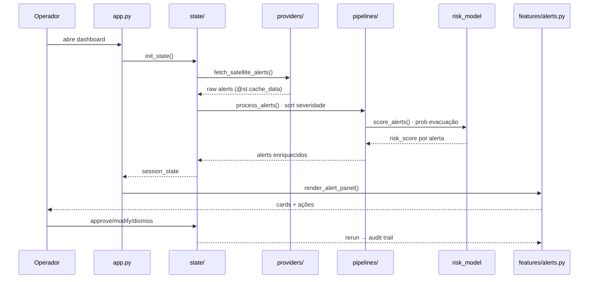

# IGNIS — Arquitetura

Diagrama de camadas, fluxo de dados e responsabilidades.

## Visão geral (camadas)

Pipeline de dados unidirecional: satélite bruto → alerta acionável na tela do operador. Cada camada tem responsabilidade única; trocar `providers/` por API real não afeta `features/` ou `ui/`.

```
┌─────────────────────────────────────────────────────────────────┐
│  EXTERNO     Satélites (GOES-16/VIIRS/MODIS)  +  INMET (clima)  │
└──────────────────────────┬──────────────────────────────────────┘
                           │ I/O bruto
                           ▼
┌─────────────────────────────────────────────────────────────────┐
│  providers/   fetch_*  ·  @st.cache_data  ·  mock pluggável     │
└──────────────────────────┬──────────────────────────────────────┘
                           │ DataFrames brutos
                           ▼
┌─────────────────────────────────────────────────────────────────┐
│  pipelines/   filtrar · enriquecer (clima) · scorar (ML)        │
│               sem dependência de Streamlit → testável isolado   │
└──────────────────────────┬──────────────────────────────────────┘
                           │ alerts enriquecidos + risk_score
                           ▼
┌─────────────────────────────────────────────────────────────────┐
│  state/       st.session_state · approve / modify / dismiss     │
│               único ponto de mutação · audit trail              │
└──────────────────────────┬──────────────────────────────────────┘
                           │ estado reativo (rerun)
                           ▼
┌─────────────────────────────────────────────────────────────────┐
│  features/    briefing · alerts · map · analytics               │
│       ui/     badges · styles OKLCH (reutilizados entre telas)  │
└──────────────────────────┬──────────────────────────────────────┘
                           │ render
                           ▼
                    Operador defesa civil
                    (decisão em segundos)
```

### Detalhe por camada

| Camada | Módulos | Funções principais |
|---|---|---|
| `providers/` | `mock_alerts.py` | `fetch_satellite_alerts()` |
| | `mock_weather.py` | `fetch_weather_forecast()` |
| | `mock_timeseries.py` | `fetch_fire_timeseries()`, `fetch_state_impact()`, `fetch_hourly_pattern()` |
| `pipelines/` | `alert_pipeline.py` | `process_alerts()`, `apply_filters()` |
| | `enrichment.py` | `enrich_with_weather()`, `aggregate_by_state()` |
| | `risk_model.py` | `FireRiskModel` (scikit-learn) |
| `state/` | `alerts_state.py` | `init_state`, approve/dismiss/modify |
| `features/` | `briefing.py` | storytelling panorama |
| | `alerts.py` | fila + audit trail |
| | `map_view.py` | Plotly Scattermapbox |
| | `analytics.py` | tabs Plotly + Matplotlib |
| `ui/` | `components.py` | `render_severity_badge`, `render_confidence_bar`, `render_sidebar_alert_summary` |
| | `styles.py` | design system OKLCH |
| root | `app.py` | entry · sidebar · roteamento |

## Fluxo do alerta (request → render)



## Responsabilidades

| Camada | Pasta | Responsabilidade |
|---|---|---|
| Providers | `providers/` | I/O bruto. HTTP, parsing. Mock substituível por API real sem mudar resto. |
| Pipelines | `pipelines/` | Transformação pura: ordenação, filtros, **scoring ML**. Sem Streamlit. |
| Modelo IA | `pipelines/risk_model.py` | scikit-learn RandomForest treinado em features sintéticas reproduzíveis. Persistido `.joblib`. |
| State | `state/` | Único ponto de mutação. Encapsula `st.session_state`. |
| Features | `features/` | Telas. Compõem UI a partir do state. |
| UI | `ui/` | Componentes visuais reutilizáveis + design tokens OKLCH. |

## Pontos-chave de design

- **Cache:** `@st.cache_data` em todos providers. Spinner no `init_state` inicial.
- **Modelo IA:** treino offline (`pipelines/train_risk_model.py`), persistido em `pipelines/risk_model.joblib`. Carregado via `@st.cache_resource`.
- **Componente reutilizável:** `render_severity_badge` invocado em `alerts.py`, `map_view.py` e sidebar.
- **Substituição produção:** trocar `providers/mock_*.py` por clientes INPE/NASA FIRMS. Pipelines/features intactos.
